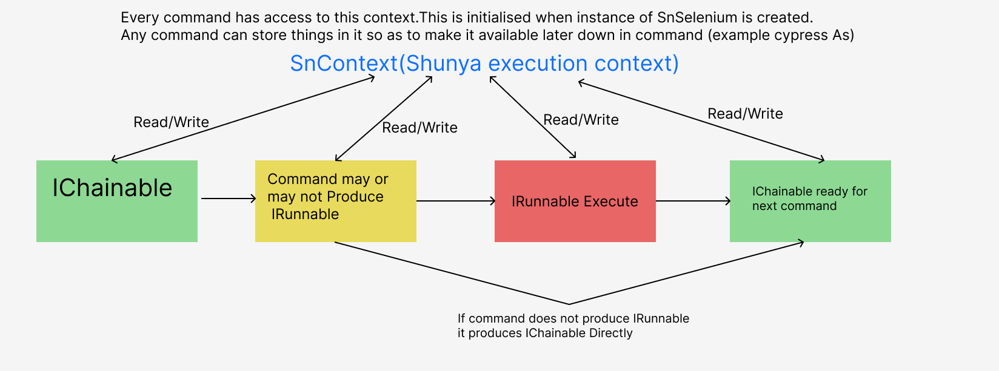

# This Project is an attempt to wrap selenium to expose Api which is somewhere inbetween C# LINQ and Cypress

## Shunya commands can be classified one of the following

- query - commands that read the state of your application
- assertion - command which assert on a given state
- action - interact with your application as a user would
- other - any other command that is useful for writing tests

## The basic execution flow is shown below

We first start by creating Instance of `IChainable` i.e. `SnSelenium` by passing Type of browser and Instance of ILogger. 
This also created context which is then passed by reference to all subsequent commands.

`SnSelenium snSel = new SnSelenium(Constants.SupportedBrowsers.CHROME,logger);`

Then we can run commands on the `snSel` as `SnSelenium` implements `IChainable` interface.

- `snSel.Visit("https://www.youtube.com/").Execute();`  

    Here snSel is of type IChainable so we can use command on it.
    All failable commands return instance of IRunnable which contains implementation of `Execute` method. 
    Such commands can be executed by calling `Execute()` on then.If you want to execute commands with retry meachanism
    you can try `.Execute(100,5)` which signifies try 5 times with duration of 500 miliseconds between tries.

 

## All Actions are chainable by default
for example

`SnSelenium snSel = new SnSelenium(Constants.SupportedBrowsers.CHROME,logger);`
`snSel.Visit("https://hasare.com/").Execute().GetOne({provide x path}).Execute()...(next commmand)`

as shown in above example we can chain commands together to accomplish the task. 
## Built in retries
Most Action are retryable by default  
So if you want cetail action to execute atmost 3 times with time duration of 100 miliseconds between each rety till it succeds
then you can pass below parameters to `Execute` Method
`Execute(100,3)` here 100 is time duration between retries and 3 iss max no of attempt

## Get Result of action
To get result of particular action we can call `GetResult()` on Result returned by `Execute` method
`IWebElement el=snSel.Visit("https://hasare.com/").Execute().GetOne({provide x path}).Execute().GetRessullt()`  
Point to note calling `GetResult` breaks the chaining ability.  

To save the result for later user but to continue execution chain please see below command `As`

## Saving result in context
As shown in diagram above Shunya initiates its own context which is used internally to store bunch of things.You can make use of same context to store result of action execution. 
`snSel.Visit("https://hasare.com/").Execute().GetOne({provide x path}).Execute().As("@elementone")...action chain`  
what this allows you do to is save the result of action and continue chaining to achive objective.But when at later point you want to use the result you can simply call 
`var context = snSel.GetContext();` Get Context
`IWebElement a=context.GetTypeValue<IWebElement>("@elementone");`  Get saved IWebElement
   **!!! One Thing to note here is you should know the type of object you are retrieving fromm context !!!**
   **!!! You could find the type of object by checking Return Type of Execute method before calling As on it !!!**

## To See what all commands are implemented please look under tests

